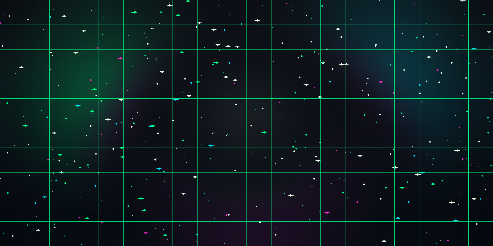

<div align="center">




<br />

<a href="#about">ABOUT</a>　·　<a href="#builds">BUILDS</a>　·　<a href="#charts">CHARTS</a>　·　<a href="#arcade">ARCADE</a>　·　<a href="#connect">CONNECT</a>

<br /><br />


</div>

<a id="about"></a>

## `./about` — NOT ANOTHER “PASSIONATE DEVELOPER” BIO

<table width="100%">
<tr>
<td width="22%" align="center" valign="middle">

<br /><br />
<a href="https://github.com/dhruvbhaskar07?tab=repositories">ENTER THE LAB →</a>
</td>
<td valign="middle">

### Hi, I'm Dhruv — I turn raw data into systems that ship.

No buzzwords. Three things I actually do:

- **SEE** — `AirDash` tracks your hand in real time. Wave, and Windows obeys. No mouse. No touch.
- **LISTEN** — `Winter AI` hears you, remembers you, acts for you. Voice + memory + desktop control.
- **PREDICT** — `RetailPulse` forecasts demand, segments customers, flags who is about to churn.

```bash
$ whoami --dhruv
role....... AI builder (vision + voice + forecasting)
location... India · building in public
currently.. turning caffeine + datasets into useful products
mantra..... IDEA -> DATA -> INTELLIGENCE -> IMPACT
```

</td>
</tr>
</table>

<div align="center">

`RAW INPUT`　→　`NEURAL MAGIC`　→　`REAL-WORLD OUTPUT`

</div>

<a id="builds"></a>

## `./builds` — SELECTED EXPERIMENTS THAT ESCAPED THE LAB

<div align="center">

<a href="https://github.com/dhruvbhaskar07/AirDash-Gesture-Control"></a>
<a href="https://github.com/dhruvbhaskar07/Winter-AI-Assistant"></a>
<a href="https://github.com/dhruvbhaskar07/RetailPulse"></a>

</div>

| Build | Superpower | Stack |
|---|---|---|
| [🖐️ AirDash](https://github.com/dhruvbhaskar07/AirDash-Gesture-Control) — wave your hand, control Windows | `██████████ 100% touchless` |  `MediaPipe` `OpenCV` |
| [🤖 Winter AI](https://github.com/dhruvbhaskar07/Winter-AI-Assistant) — a desktop assistant with a memory | `████████░░ 80% autonomous` |  `PyQt5` `Voice AI` |
| [📊 RetailPulse](https://github.com/dhruvbhaskar07/RetailPulse) — sees next month's sales today | `███████░░░ 70% prophet-powered` |  `Prophet` `XGBoost` |

<details>
<summary><b>🧪 More from the lab (click to expand)</b></summary>
<br />

- **[🔎 CodeAlpha Analytics](https://github.com/dhruvbhaskar07/codealpha_tasks)** — web scraping, sentiment analysis, data viz. Where it all started.
- **[📦 All repositories →](https://github.com/dhruvbhaskar07?tab=repositories)** — every experiment, notebook and prototype.

</details>

<a id="charts"></a>

## `./charts` — PROOF, NOT PROMISES

<div align="center">


<br />


`every green square = one more system that didn't exist yesterday`

</div>

<a id="arcade"></a>

## `./arcade` — THE SNAKE THAT EATS MY COMMITS

<div align="center">

<picture>
  <source media="(prefers-color-scheme: dark)" srcset="assets/github-snake-dark.svg" />
  
</picture>

*Regenerated every midnight by GitHub Actions. If the snake looks hungry, I haven't shipped enough today.*

[](https://github.com/dhruvbhaskar07/AirDash-Gesture-Control)
[](https://github.com/dhruvbhaskar07/Winter-AI-Assistant)
[](https://github.com/dhruvbhaskar07/RetailPulse)

</div>

## `cat ./toolkit` — WEAPONS OF CHOICE

<div align="center">

<a href="https://github.com/search?q=user%3Adhruvbhaskar07+language%3APython&type=code"></a>
<a href="https://github.com/search?q=user%3Adhruvbhaskar07+opencv&type=code"></a>
<a href="https://github.com/search?q=user%3Adhruvbhaskar07+language%3Ahtml&type=code"></a>
<a href="https://github.com/search?q=user%3Adhruvbhaskar07+language%3Ajavascript&type=code"></a>
<a href="https://github.com/search?q=user%3Adhruvbhaskar07+machine+learning&type=code"></a>

<br />

`click any icon — it searches my actual code, not a tutorial list`

</div>

<a id="connect"></a>

## `./connect` — FIND ME ON THE NETWORK

<div align="center">

[](https://github.com/dhruvbhaskar07)
[](https://github.com/dhruvbhaskar07?tab=repositories)

<br />

```text
01000100 01001000 01010010 01010101 01010110
BUILD IN PUBLIC · STAY CURIOUS · SHIP USEFUL THINGS
```


`END OF TRANSMISSION // DHRUV.OS v2 — CINEMATIC TERMINAL`

</div>
