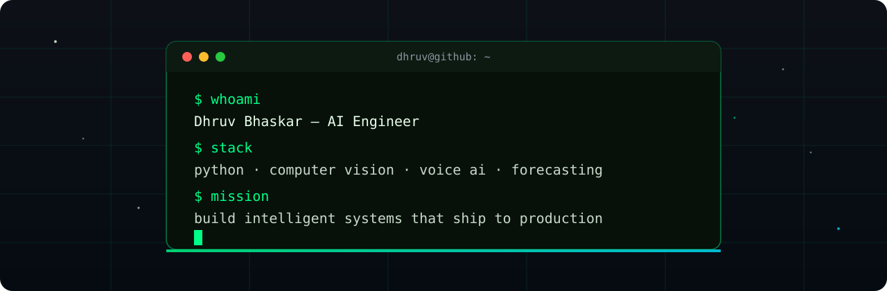
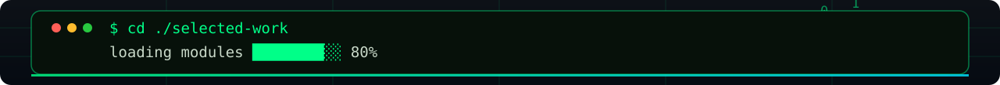
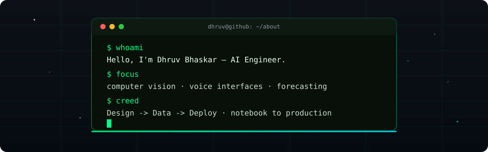
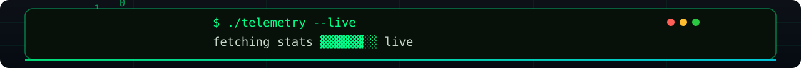

<div align="center">




<br />

<a href="#about">ABOUT</a>　·　<a href="#builds">BUILDS</a>　·　<a href="#telemetry">TELEMETRY</a>　·　<a href="#toolkit">TOOLKIT</a>　·　<a href="#arcade">ARCADE</a>　·　<a href="#connect">CONNECT</a>
<br />


</div>

<div align="center">



</div>

<a id="about"></a>

## About

<div align="center">



`AI Engineer (vision · voice · forecasting) — India · building in public`

</div>

<a id="builds"></a>

## Selected Builds

<div align="center">

|  |  |
|---|---|
| <a href="https://github.com/dhruvbhaskar07/AirDash-Gesture-Control"></a> | <a href="https://github.com/dhruvbhaskar07/Winter-AI-Assistant"></a> |
| <a href="https://github.com/dhruvbhaskar07/RetailPulse"></a> | **[🔎 CodeAlpha Analytics](https://github.com/dhruvbhaskar07/codealpha_tasks)** — Web scraping, sentiment analysis, and data visualization.<br /><br />[📦 All repositories →](https://github.com/dhruvbhaskar07?tab=repositories) |

</div>

| Project | What it does | Stack |
|---|---|---|
| [🖐️ AirDash](https://github.com/dhruvbhaskar07/AirDash-Gesture-Control) | Touchless Windows control with real-time hand tracking | `Python` `MediaPipe` `OpenCV` |
| [🤖 Winter AI](https://github.com/dhruvbhaskar07/Winter-AI-Assistant) | Voice-driven desktop assistant with long-term memory | `Python` `PyQt5` `Voice AI` |
| [📊 RetailPulse](https://github.com/dhruvbhaskar07/RetailPulse) | Demand forecasting, customer segmentation, churn signals | `Prophet` `XGBoost` `LSTM` |

<div align="center">



</div>

<a id="telemetry"></a>

## Telemetry

<div align="center">


</div>

<a id="toolkit"></a>

## Toolkit

<div align="center">

<a href="https://github.com/search?q=user%3Adhruvbhaskar07+language%3APython&type=code"></a>
<a href="https://github.com/search?q=user%3Adhruvbhaskar07+opencv&type=code"></a>
<a href="https://github.com/search?q=user%3Adhruvbhaskar07+language%3Ahtml&type=code"></a>
<a href="https://github.com/search?q=user%3Adhruvbhaskar07+language%3Ajavascript&type=code"></a>
<a href="https://github.com/search?q=user%3Adhruvbhaskar07+machine+learning&type=code"></a>
<br />

`Select an icon to search my code by technology.`

</div>

<a id="arcade"></a>

## Arcade

<div align="center">

<picture>
  <source media="(prefers-color-scheme: dark)" srcset="assets/github-snake-dark.svg" />
  
</picture>

*Updated daily by GitHub Actions from my contribution graph.*

[](https://github.com/dhruvbhaskar07/AirDash-Gesture-Control)
[](https://github.com/dhruvbhaskar07/Winter-AI-Assistant)
[](https://github.com/dhruvbhaskar07/RetailPulse)

</div>

<a id="connect"></a>

## Connect

<div align="center">

[](https://github.com/dhruvbhaskar07)
[](https://github.com/dhruvbhaskar07?tab=repositories)
<br />

```text
BUILD IN PUBLIC · STAY CURIOUS · SHIP USEFUL THINGS
```


`© 2026 Dhruv Bhaskar`

</div>
